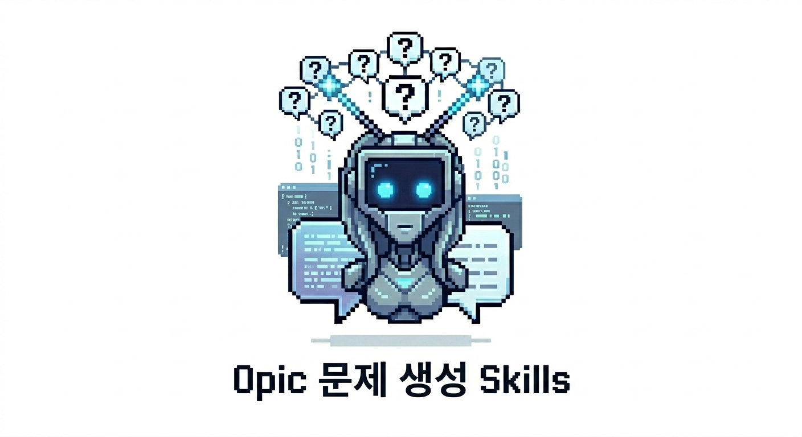

# OPIc Question Generator Skill

[English](README.md) | [한국어](README.ko.md)



> **AI 에이전트용 OPIc English 연습 Skill — 문제 생성, 답변 교정, 레벨 코칭을 자연어로.**

[](LICENSE)
[](https://agentskills.io)
[](https://www.actfl.org/opic)

---

## 이 Skill이 뭔가요?

이 저장소는 **`SKILL.md` 파일** 하나를 포함하고 있습니다. 호환되는 AI 에이전트에 로드하면 **OPIc English 전용 연습 코치**로 변신합니다.

로드하면 에이전트가 할 수 있는 것들:

| 기능 | 설명 |
|---|---|
| 📝 **문제 생성** | 어떤 주제로든 OPIc 스타일 문제 생성 (내 서베이 주제 포함) |
| 🎯 **모의고사 생성** | 실제 시험과 동일한 형식의 15문항 모의고사 |
| ✏️ **답변 교정** | 작성하거나 말한 답변의 문법, 자연스러움, 유창성 교정 |
| 🔄 **레벨별 리라이팅** | 같은 답변을 IM, IH, AL 수준으로 변환해 차이 비교 |
| 🤝 **인터랙티브 코칭** | 문제 1개씩 → 내 답변 → 즉시 피드백의 실전 연습 |

---

## 실제로 어떻게 쓰나요?

OPIc은 **말하기 시험**입니다. 크게 두 가지 연습 방식으로 활용할 수 있어요.

### 🗣️ 방식 1 — 말하기 연습 (실전에 가장 가깝게)

**ChatGPT Advanced Voice Mode**에 이 skill을 연결해 사용합니다 ([음성 연습 설정](#음성-연습-설정--chatgpt-advanced-voice-mode) 참고). AI가 소리내어 질문하고, 내가 소리내어 답하면 AI가 바로 피드백을 줍니다. 실제 시험 환경과 가장 유사한 연습 방법입니다.

### ✍️ 방식 2 — 작성 + 교정

1. 모의고사를 뽑아달라고 요청
2. 답변을 작성 (종이든, 메모앱이든, 채팅창에 직접이든)
3. 답변을 붙여넣으면 AI가 교정

특별한 형식 없이 그냥 답변을 붙여넣으면 됩니다. AI가 알아서 교정해줘요.

---

## 사용법

### 모의고사 뽑기

```
오픽 모의고사 15문항 만들어줘.
내 서베이 주제는 movies, youtube, cafe, technology야.
```

서베이 주제를 아직 모른다면 랜덤으로:
```
오픽 모의고사 15문항 랜덤으로 만들어줘.
```

> 💡 **팁:** 실제 OPIc에서는 같은 주제를 3연속으로 다르게 묻는 **콤보 문제**가 나옵니다 (묘사 → 루틴 → 과거 경험). 콤보 형식으로 연습하고 싶다면:
> ```
> cafe 주제로 3문항 콤보 만들어줘.
> ```

---

### 답변 교정받기

답변을 작성한 뒤 그냥 붙여넣으면 됩니다. 아무 설명 없이 바로 던져도 AI가 알아서 교정해줍니다:

```
I usually go to cafe on weekend. I like to drink americano and read book.
Last week, I went to new cafe near my house. It was very cozy and quiet.
```

모의고사 여러 답변을 한꺼번에 교정받고 싶다면 번호를 붙여서:

```
Q1. I usually go to cafe on weekend...
Q3. My favorite movie is Interstellar. I watched it when I was in high school...
```

---

### 인터랙티브 코칭 (실시간 1문제씩)

다음 문제를 보기 전에 직접 답하는 방식으로 연습하고 싶다면:

```
오픽 연습 파트너처럼 진행해줘.
문제 1개씩 내고, 내 답변을 받은 다음 교정하고 다음 문제로 넘어가줘.
서베이 주제는 movies, cafe, technology야.
```

---

### 레벨업 리라이팅

내 답변이 IM, IH, AL 수준에서 어떻게 달라지는지 직접 비교해보고 싶다면:

```
이 답변을 IM, IH, AL 스타일로 각각 바꿔줘:

I usually go to cafe on weekend. I like to drink americano and read book.
```

---

## 음성 연습 설정 — ChatGPT Advanced Voice Mode

OPIc은 말하기 시험이니 실제로 소리내어 연습하는 게 중요합니다. 가장 효과적인 방법은 **ChatGPT Advanced Voice Mode**에 이 skill을 붙여 쓰는 것입니다.

**Step 1.** 이 저장소에서 [`SKILL.md`](SKILL.md)를 열고 전체 내용을 복사합니다.

**Step 2.** ChatGPT → **설정 → 개인화 → Custom Instructions**  
**"ChatGPT에 대해 알아야 할 사항"** 필드에 붙여넣고 저장합니다.

**Step 3.** ChatGPT 모바일 앱을 열고 오른쪽 하단의 **음성 아이콘**을 탭합니다.  
Advanced Voice Mode가 시작됩니다.

**Step 4.** 말로 요청합니다:
```
오픽 질문 하나 해줘. 내가 답하면 영어 교정해주고 다음 문제로 넘어가줘.
```

ChatGPT가 소리내어 질문하고, 내 말을 듣고, 교정을 소리로 알려줍니다. 집에서 할 수 있는 가장 실전에 가까운 연습입니다.

> **조건:** ChatGPT Plus 이상 필요. Advanced Voice Mode는 iOS / Android 앱에서 사용 가능합니다.

---

## 설치 방법

### CLI 에이전트 도구 (Claude Code, Codex, Gemini CLI 등)

이 skill은 [Agent Skills 오픈 표준](https://agentskills.io)을 따릅니다. CLI 에이전트 도구를 쓰고 있다면 `skills` CLI 하나로 모든 도구에 한 번에 설치할 수 있습니다:

```bash
npx skills add AIKONG2024/opic-question-generator-skill
```

설치된 에이전트를 자동 감지해서 각각의 폴더에 심링크를 생성해줍니다. **Claude Code, Codex CLI, Gemini CLI, OpenClaw, Cursor** 등 Agent Skills 호환 도구라면 전부 한 번에 설정됩니다.

> **npx가 없다면?** Node.js 설치가 필요합니다. 또는 아래 표를 참고해 수동으로 클론하세요.

| 도구 | 수동 설치 경로 |
|---|---|
| Claude Code | `~/.claude/skills/` |
| Codex CLI | `~/.codex/skills/` 또는 `.agents/skills/` |
| Gemini CLI | `gemini skills install <repo-url>` |
| OpenClaw | `~/.openclaw/skills/` |
| Hermes | `~/.hermes/skills/` |

### GUI 도구

**Claude.ai / Claude Cowork:**
1. **설정 → 기능** → **코드 실행 및 파일 생성** 활성화
2. 이 GitHub 페이지에서 **Code → Download ZIP**
3. **Customize → Skills → [+] → Create skill → Upload a skill** → ZIP 선택 후 업로드
4. Skills 목록에서 토글 켜기

**Gemini 웹:**  
Native skill 지원 없음. [`SKILL.md`](SKILL.md) 내용을 복사해 대화 첫 메시지로 전송:
```
이번 대화에서 다음 지시를 따라줘: [여기에 붙여넣기]
```

---

## 참고

- **OPIc English 전용**입니다 — OPIc Korean(한국어)은 지원하지 않습니다
- **비공식** 연습용 도구로, ACTFL 또는 시험 기관과 무관합니다
- 공식 OPIc 시험 문제를 포함하거나 재현하지 않습니다

---

*시험 잘 보세요! 🎯*
